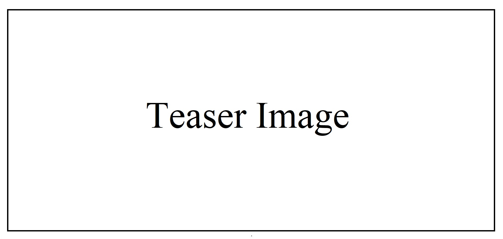
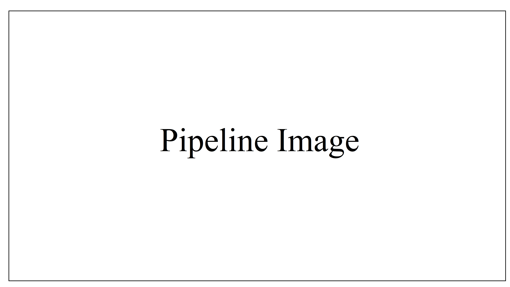

# ProjectName: Short Project Description

<a href="https://arxiv.org/"></a>
<a href="https://colab.research.google.com/"></a>
[](./LICENSE)


>Abstract / High-level summary of your project. Provide a concise overview of your project, summarizing the problem it addresses, the methodology employed, and its key contributions in 2–3 sentences. You may use text from the corresponding article if applicable.
>



## Updates

- [DD/MM/YYYY] 🎉 Initial release of ProjectName.
- [DD/MM/YYYY] 🚀 Added feature X.
- [DD/MM/YYYY] 📄 Paper accepted at [Conference/Journal].

## Prerequisites

To run our method, please ensure you meet the following hardware and software requirements:
- **Operating System**: Linux / macOS / Windows
- **GPU**: NVIDIA (e.g., A100 / V100 and shiuld be specified RAM size, e.g. V100 with 40GB RAM) [optional] 
- **Python**: >= 3.8
- Frameworks/Libraries:
- PyTorch >= 2.0
- Diffusers >= 0.29
- Others: requirements.txt


## Setup

* Clone repository:
```bash
git clone https://github.com/YourOrg/ProjectName.git
cd ProjectName
```

* Create environment (conda example)::
```bash
conda env create -f environment.yaml
conda activate project_env
```

*(Optional) Download required models/data:
```bash
git lfs install
git clone https://huggingface.co/YourModel/Weights
```

## Inference / Usage
```bash
python main.py --param1 value1 --param2 value2
```

### Key Parameters

 - `input_path`: Path to input image/data
 - `output_path`: Directory to save results
 - `prompt`: Text description for generation/editing
 - `config`: Path to config file (e.g., configs/default.yaml)

### Example command:

```bash
python main.py --input_path ./examples/input.png \
--output_path ./results/ \
--prompt "A photo of a golden retriever" \
--config ./configs/default.yaml
```

## Quickstart

We provide examples of applying our pipeline to real image editing in the [notebook](example_notebooks/material_transfer.ipynb).

- Example Jupyter Notebook: [examples/demo.ipynb](example_notebooks/material_transfer.ipynb)
- Pretrained models & sample datasets available [here](example_notebooks/material_transfer.ipynb)


## Method Diagram
<p align="center">
  
  <br>
</p>
<p align="center">
  <br>
The overall pipeline of MaterialFusion for material transfer. Starting with DDIM inversion of the target image $x_{init}$ and material exemplar $y_{im}$, the framework combines the IP-Adapter with UNet and employs a guider energy function for precise material transfer. A dual-masking strategy ensures material application only on target regions while preserving background consistency, ultimately generating the edited output $x_{edit}$. The parameter $\lambda$, known as the Material Transfer Force, controls the intensity of the material application, enabling adjustment of the transfer effect according to user preference.
</p>

## References & Acknowledgments

The repository was started from [Guide-and-Rescale](https://github.com/AIRI-Institute/Guide-and-Rescale).

## Citation

If you utilize this code in your research, kindly cite our paper:
```
@article{garifullin2025materialfusion,
  title={MaterialFusion: High-Quality, Zero-Shot, and Controllable Material Transfer with Diffusion Models},
  author={Kamil Garifullin and Maxim Nikolaev and Andrey Kuznetsov and Aibek Alanov},
  journal={arXiv preprint arXiv:2502.06606},
 year={2025}
}
```